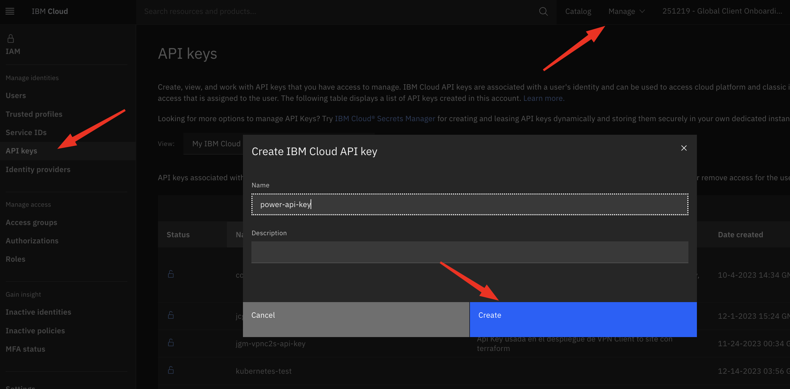
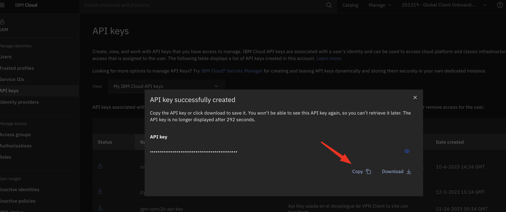
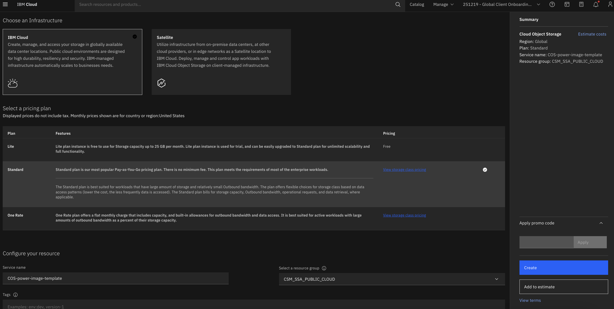
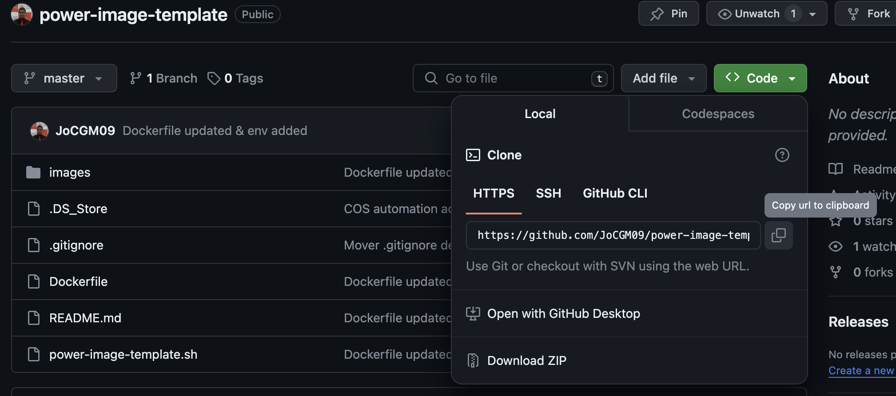

# power-image-template

_Este repositorio contiene el script en bash que importa automáticamente la imagen de una instancia virtual Power en IBM Cloud y la exporta en un IBM Cloud Object Storage. Para la implementación es necesario tener ya creado y configurado tanto un Workspace como una instancia virtual Power VS precargada y configurada._

## Contenido 📋
1. [Crear una IBM Cloud API key](#procedimiento)
2. [Crear un bucket en IBM Cloud Object Storage]()
2. [Clonar el repositorio](#clonar-el-respositorio)
4. [Crear una imagen con Docker](#crear-una-imagen-con-docker)
5. [Subir la imagen a IBM Cloud Container Registry]()
6. [Crear el Batch Job en Code Engine]()

## Procedimiento

### Crear una IBM Cloud API key

Ingresar en IAM para crear una API-KEY que permita la conexión a ibmcloud mediante la identificación del usuario.

- Ingresar a Manage -> Access IAM -> Api keys -> My IBM Cloud API keys -> Create 



- Generamos la llave y la copiamos para más adelante.



### Crear un bucket en IBM Cloud Object Storage

- Ingresar al catálogo de IBM Cloud y buscar IBM Cloud Object Storage.
- Seleccionar los siguientes parámetros:
    - Infraestructura: IBM Cloud 
    - Plan: Lite si no existe una instancia gratuita o Standard de ya ocupar una.
    - Nombre de servicio: Ingresar un nombre a elección
    - Grupo de recurso: Ingresar el grupo de recurso a utilizar, de no colocar se creará en Default.
    - Tags (opcional)



### Clonar el respositorio

- Ingresar al repositorio principal y seleccionar la opción ´Code´ -> HTTPS y copiar el URL.



- Abrir una terminal y cambiar el directorio de trabajo actual a la ubicación en donde quieres clonar el directorio.

- Escribir `git clone` y pegar el URL del repositorio.

```
git clone https://github.com/JoCGM09/power-image-template.git
```
### Crear una imagen con Docker
