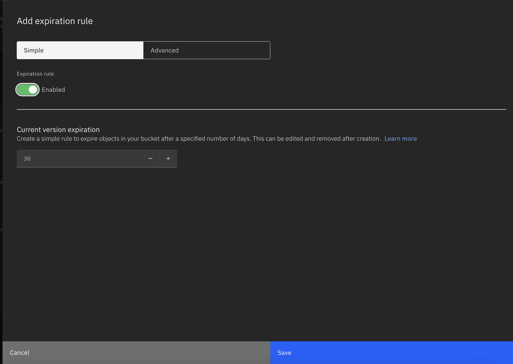
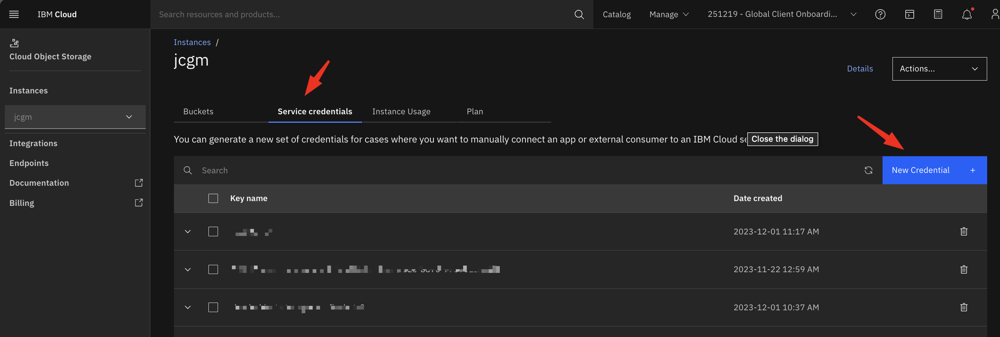
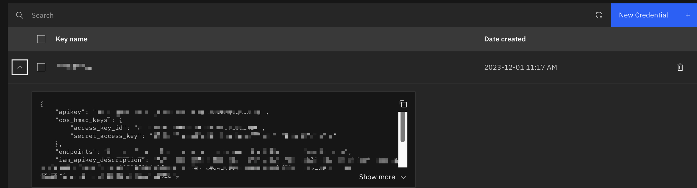

# power-image-template

_Este repositorio contiene el script en bash que importa automáticamente la imagen de una instancia virtual Power en IBM Cloud y la exporta en un IBM Cloud Object Storage. Para la implementación es necesario tener ya creado y configurado tanto un Workspace como una instancia virtual Power VS precargada y configurada._

## Contenido 📋
1. [Crear una IBM Cloud API key](#crear-una-ibm-cloud-api-key)
2. [Crear un bucket en IBM Cloud Object Storage](#crear-un-bucket-en-ibm-cloud-object-storage)
3. [Crear una credencial de servicio en IBM Cloud Object Storage](#crear-una-credencial-de-servicio-en-ibm-cloud-object-storage)
4. [Clonar el repositorio](#clonar-el-respositorio)
5. [Subir la imagen a IBM Cloud Container Registry](#subir-la-imagen-a-ibm-cloud-container-registry)
6. [Crear el Batch Job en Code Engine](#crear-el-batch-job-en-code-engine)

## Procedimiento

### Crear una IBM Cloud API key

Ingresar en IAM para crear una API-KEY que permita la conexión a ibmcloud mediante la identificación del usuario.

- Ingresar a Manage -> Access IAM -> Api keys -> My IBM Cloud API keys -> Create.


- Generamos la llave y la copiamos para más adelante.


### Crear un bucket en IBM Cloud Object Storage

- Ingresar al catálogo de IBM Cloud y buscar IBM Cloud Object Storage.
- Seleccionar los siguientes parámetros:
    - Infraestructura: IBM Cloud 
    - Plan: Lite si no existe una instancia gratuita o Standard de ya ocupar una.
    - Nombre de servicio: Ingresar un nombre a elección.
    - Grupo de recurso: Ingresar el grupo de recurso a utilizar, de no colocar se creará en Default.
    - Tags (opcional).


- Ingresar a la instancia de Object Storage y selecciona Crear Bucket.


- Seleccionar los siguientes parámetros:
    - Nombre de bucket: Ingresa un nombre único a nivel global para tu bucket.
    - Resiliencia: Regional.
    - Locación: Dallas (us-south).
    - Clase de almacenamiento: Smart tier.
    - Versionamiento de objetos: Deshabilitado.
    - Configuración avanzada: Agregar regla de vencimiento (el objeto se eliminará automáticamente después de 30 días).
        - Tipo: Simple.
        - Regla de vencimiento: Habilitada.
        - Vencimiento de versión: 30 días.
        - Seleccionar Guardar.



Seleccionar Crear Bucket

### Crear una credencial de servicio en IBM Cloud Object Storage

- Seleccionar la opción de Credencial de Servicio y seleccionar Nueva Credencial.



- Ingresar los siguientes parámetros:
    - Nombre.
    - Rol: Escritura.
    - ID de servicio: Autogenerado.
    - Incluir credencial HMAC: Habilitar.

- Seleccionar Agregar.

Al esperar que termine de crear, desplegar las credenciales y copiar las `cos_hmac_keys`, tanto el `access_key_id` como el `secret_access_key` y las copiamos para más adelante.



### Clonar el respositorio

- Ingresar al repositorio principal y seleccionar la opción ´Code´ -> HTTPS y copiar el URL.


- Abrir una terminal y cambiar el directorio de trabajo actual a la ubicación en donde quieres clonar el directorio.

- Escribir `git clone` y pegar el URL del repositorio.

```
git clone https://github.com/JoCGM09/power-image-template.git
```
### Subir la imagen a IBM Cloud Container Registry

Este paso está documentado en la guía "Batch Job en Code Engine".

### Crear el Batch Job en Code Engine

> :Note: **Nota importante**: <br>
Al crear el Batch Job en Code Engine deberás crear las siguientes variables de entorno usando los mismos nombres:

- `IBM_CLOUD_API_KEY`: API Key de IBM Cloud
- `IBM_POWER_WORKSPACE_NAME`: Nombre del Workspace de Power VS
- `IBM_POWER_INSTANCE_NAME`: Nombre de la instancia a capturar
- `COS_ACCESS_KEY`: Access_key_id de las credenciales cos_hmac_keys de las Credenciales de Servicio de IBM COS
- `COS_SECRET_KEY`: Secret_access_key de las credenciales cos_hmac_keys de las Credenciales de Servicio de IBM COS

Este paso está documentado en la guía "Batch Job en Code Engine".


